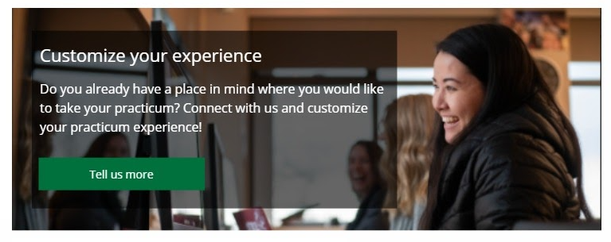
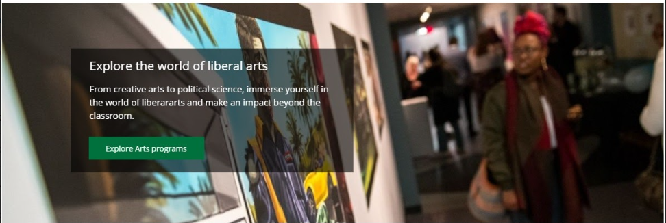
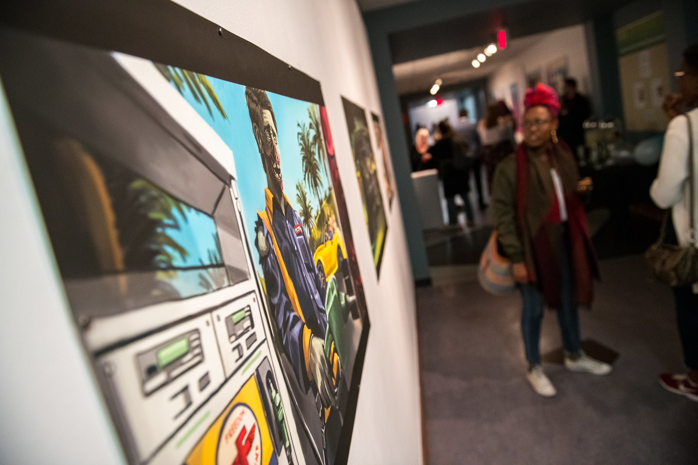

# COA Content Type Development

https://drive.google.com/file/d/1mcOu70qa-dg-E6cA9OPRG4z9cbHOQvKJ/view

## Wrike Project 
https://www.wrike.com/workspace.htm?acc=3950324#/task-view?id=758114589&pid=608002304&cid=555855785

# Expandable text element

https://www.wrike.com/workspace.htm?acc=3950324#/task-view?id=758127575&cid=555855785&pid=608002304

TODO: Working URL?

An updated version of the Student FAQ content type, but doesn't need the category/domestic/etc piece at all 
(https://myweb.ufv.ca/terminalfour/SiteManager?ctfn=template&fnno=10&tid=277&gid=55 )

- Non-expanded should be font-awesome icon 'fal f13a' in our dark green outline
- Expanded should be font-awesome solid icon ' fas f13a' with dark green
- Content type should have option to be full-width or half-width
    - Fields:
    - Header (question)
    - Answer (html content)
- light grey line at bottom of answer

# 2. Content box with background image, text box, green CTA button

Can we create one content type that will go edge-to-edge on the full-width layout and then full column width on a typical inner-page layout?

Needs:
1. uploadable background image
2. Text box (LH placement - we may need to play with width)
translucent background
3. header field (white text)
4. teaser field (white text)
5. dark green CTA button link field

On mobile:
1. Layout should shift so image is full-width at top
2. Text box drops below image, goes to 100% width
3. What should background color or text box be on mobile?? Dark grey??

