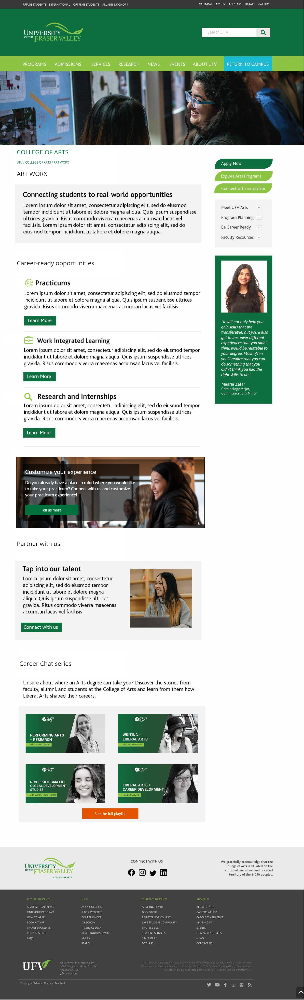

# 2. Content box with background image, text box, green CTA button

Can we create one content type that will go edge-to-edge on the full-width layout and then full column width on a typical inner-page layout?

Needs:
1. uploadable background image
2. Text box (LH placement - we may need to play with width)
translucent background
3. header field (white text)
4. teaser field (white text)
5. dark green CTA button link field

On mobile:
1. Layout should shift so image is full-width at top
2. Text box drops below image, goes to 100% width
3. What should background color or text box be on mobile?? Dark grey??

